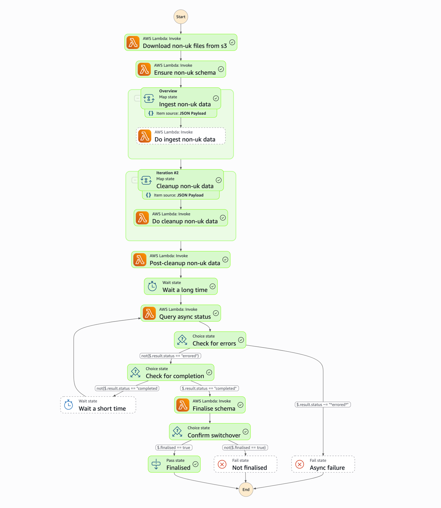

# Address Lookup Non-UK Ingest Lambda Function

A suite of serverless AWS Lambda functions to ingest and process Non-UK address lookup data.

## Table of Contents

- [Overview](#overview)
- [Lambda Functionality](#lambda-functionality)
    - [InternationalAddressesFileDownloadLambdaFunction](#internationaladdressesfiledownloadlambdafunction)
    - [InternationalAddressesEnsureSchemaLambdaFunction](#internationaladdressesensureschemalambdafunction)
    - [InternationalAddressesIngestLambdaFunction](#internationaladdressesingestlambdafunction)
    - [InternationalAddressesCleanupLambdaFunction](#internationaladdressescleanuplambdafunction)
    - [InternationalAddressesPostIngestLambdaFunction](#internationaladdressespostingestlambdafunction)
    - [InternationalAddressesCheckStatusLambdaFunction](#internationaladdressescheckstatuslambdafunction)
    - [InternationalAddressesFinaliseLambdaFunction](#internationaladdressesfinaliselambdafunction)

## Overview

This Lambda ingests Non-UK address data from an external source and loads it into a datastore suitable for
downstream address lookup services. It is designed for efficient, event-driven, and scalable address data
processing within AWS.

The lambads in this repository are executed as part of a Step Function workflow defined in
[cip-attrep-terraform ](https://github.com/hmrc/cip-attrep-terraform/blob/main/cip-address-lookup/main.tf#L847-L1024)

The following diagram illustrates the workflow of the Address Lookup Non-UK Ingest Lambda Function:

## Lambda Functionality

### InternationalAddressesFileDownloadLambdaFunction

This Lambda function downloads international address files from an S3 bucket.
It accepts input parameters for the S3 bucket name and a force flag
(to control overwriting existing files). It uses these parameters to trigger a
file download via an S3FileDownloader, then returns a list of files to ingest.

### InternationalAddressesEnsureSchemaLambdaFunction

This Lambda function ensures that a database schema exists for international
address ingestion. When triggered, it creates the schema if needed
(using the IngestRepository), waits for the operation to complete, and then
updates the input data with the schema name. It also adds the schema name to
each file's metadata and populates a list of countries with the schema name,
preparing the data for further processing.

### InternationalAddressesIngestLambdaFunction

This Lambda function ingests international address data into a database. It receives
input specifying a schema name, country, and file to ingest. The function then calls
the repository’s ingest method to process the file for the given schema and country,
waiting for the operation to complete before returning the result (a Long value, likely
representing the number of records ingested or a status code).

### InternationalAddressesCleanupLambdaFunction

This Lambda function performs cleanup processing for international address data. When
triggered, it receives a schema name and country, then calls a repository method to
expand JSON fields for that country in the specified schema. It waits for the cleanup to
complete before returning the country and schema name as output.

### InternationalAddressesPostIngestLambdaFunction

This Lambda function performs post-ingest processing for international address data.
It receives a schema name and a list of countries as input, then calls a repository method
to process the data for each country in the specified schema. The function waits for the
processing to complete and returns the schema name as output.

### InternationalAddressesCheckStatusLambdaFunction

This Lambda function checks the status of international address ingestion for a given schema.
When triggered with a schema name, it queries the repository for status and error messages,
processes the results, and returns a map containing the overall status and any error message
related to the ingestion process.

### InternationalAddressesFinaliseLambdaFunction

This Lambda function finalises the international address ingestion process. It receives a
schema name as input, then calls the repository’s finalise method for that schema, waits for
the operation to complete, and returns a Boolean indicating success or failure.

## Notes

- This currently requires Java 17

### License
This code is open source software licensed under the [Apache 2.0 License]("http://www.apache.org/licenses/LICENSE-2.0.html").

